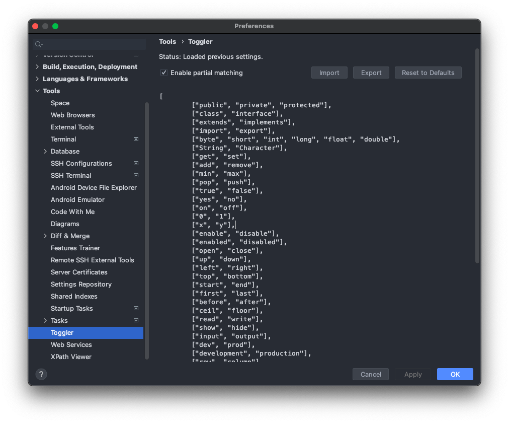

<h1 align="center">
  <br>
  <a href="https://github.com/Noorts/Toggler"></a>
  <br>
  Toggler
  <br>
</h1>
<h4 align="center">
  Toggler is a JetBrains IDE Plugin that allows you to quickly toggle words and symbols with a hotkey.<br>
  Toggles can be configured from the settings menu.
</h4>
<p align="center">
  <a href="https://plugins.jetbrains.com/plugin/16166-toggler"></a>
  <a href="https://plugins.jetbrains.com/plugin/16166-toggler"></a>
  <a href="https://plugins.jetbrains.com/plugin/16166-toggler"></a>
</p>
<p align="center">
  <a href="#features">Features</a> •
  <a href="#usage">Usage</a> •
  <a href="#installation">Installation</a> •
  <a href="#configuration">Configuration</a> •
  <a href="#roadmap">Roadmap</a> •
  <a href="#contribute">Contribute</a> •
  <a href="#alternatives">Alternatives</a> •
  <a href="#acknowledgements">Acknowledgements</a> •
  <a href="#license">License</a>
  <br><br>
  
</p>
<br>

Do you really like Toggler? Consider giving a star on [GitHub](https://github.com/Noorts/Toggler) or leaving a review on the [JetBrains marketplace](https://plugins.jetbrains.com/plugin/16166-toggler).

Did you find a bug or do you have a feature request? Feel free to open an issue on [GitHub](https://github.com/Noorts/Toggler/issues).

## Features
- Customizable through the settings menu.
- Support for multiple cursors.
- Support for numerous toggles.
- Support for partial matches.
- Limited support for transferring word case.
- Easy importing and exporting of the JSON configuration.
- No external dependencies required.

## Usage
Select or place your cursor on a word/symbol and press the hotkey
(by default <kbd>Ctrl+Shift+X</kbd> on Windows or <kbd>Cmd+Shift+X</kbd> on macOS) to
toggle the word/symbol to the next toggle defined in the configuration file (wrapping around when it reaches the end).
The shortcut can be changed from <kbd>Settings/Preferences -> Keymap -> Plug-ins -> Toggler</kbd>.
The toggle action can also be found as <kbd>Toggle Word/Symbol</kbd> in the <kbd>Edit</kbd> menu.

The partial matching functionality allows for substrings of words/symbols to be toggled. E.g. `getName` could be
toggled to `setName` by placing the cursor anywhere on `get` and then activating the toggle action.
The largest match found is prioritised. This means that if you have the following toggles configured `["dev", "prod"],
["development", "production"]` and toggle `development`, then it will be replaced with `production`. The partial
matching functionality can be bypassed by using your cursor to create a precise selection of the sub word/symbol you
want to toggle. The partial matching functionality (which is enabled by default) can also be disabled completely in
the configuration menu.

## Installation
There are four ways to install Toggler:
- Install from the [JetBrains marketplace](https://plugins.jetbrains.com/plugin/16166-toggler).
- Install directly from the plugin marketplace in your JetBrains product. Go to <kbd>Settings/Preferences -> Plugins -> Marketplace -> Search for "Toggler" -> Install Plugin</kbd>.
- Download the jar from a GitHub [release](https://github.com/Noorts/Toggler/releases) and install manually.
  Go to the <kbd>Settings/Preferences -> Plugins -> Press the ⚙️ (in the top right) -> Choose "Install Plugin from Disk..."</kbd>.
- Download this repo, build the plugin and install it manually. Also see the [contribute](#contribute) section.

## Configuration
You can configure the toggles in your IDE by going to <kbd>Settings/Preferences -> Tools -> Toggler</kbd>.


Toggles can be added and removed by modifying the JSON inside the configuration menu and subsequently
pressing the `Apply` button. The `Import`, `Export` and `Reset to Defaults` buttons have been added for convenience.

The following [boundary characters](https://github.com/Noorts/Toggler/blob/master/src/main/java/core/Config.java#L11)
are used for word/symbol selection internally and thus can't be used inside the toggles
<code>' ', ';', ':', '.', ',', '`', '"', ''', '(', ')', '[', ']', '{', '}', '\t'</code>.

The [toggles](https://github.com/Noorts/Toggler/blob/master/src/main/java/core/Config.java#L22) displayed below
are the default ones included with every fresh installment.
```JSON
[
  ["public", "private", "protected"],
  ["class", "interface"],
  ["extends", "implements"],
  ["import", "export"],
  ["byte", "short", "int", "long", "float", "double"],
  ["String", "Character"],

  ["get", "set"],
  ["add", "remove"],
  ["min", "max"],
  ["pop", "push"],

  ["true", "false"],
  ["yes", "no"],
  ["on", "off"],
  ["0", "1"],
  ["x", "y"],
  ["enable", "disable"],
  ["enabled", "disabled"],
  ["open", "close"],

  ["up", "down"],
  ["left", "right"],
  ["top", "bottom"],
  ["start", "end"],
  ["first", "last"],
  ["before", "after"],
  ["ceil", "floor"],
  ["read", "write"],
  ["show", "hide"],
  ["input", "output"],
  ["dev", "prod"],
  ["development", "production"],
  ["row", "column"],
  ["req", "res"],

  ["&&", "||"],
  ["&", "|"],
  ["<", ">"],
  ["+", "-"],
  ["*", "/"],
  ["++", "--"],
  ["+=", "-="],
  ["*=", "/="],
  ["&=", "|="],
  ["<<=", ">>="],
  ["<=", ">="],
  ["==", "!="],
  ["===", "!=="]
]
```

## Roadmap
The roadmap can be found on the [Toggler board](https://github.com/users/Noorts/projects/2).

## Contribute
1. [Fork](https://docs.github.com/en/get-started/quickstart/fork-a-repo) and
[clone](https://docs.github.com/en/repositories/creating-and-managing-repositories/cloning-a-repository) the repository.
2. Set up your development environment (I use [IntelliJ IDEA](https://www.jetbrains.com/idea/) for Toggler's development).
   * Open the project and load the Gradle project. A notification should show up in the bottom right indicating
"Gradle build scripts found".
   * Install Java 11 and make sure it's set as the SDK and language level in the
[project structure settings](https://www.jetbrains.com/help/idea/project-settings-and-structure.html).
3. Verify whether you're ready to start development by running the development IDE through Gradle's `runIde` task.
This task should be available under `Toggler/Tasks/intellij` in
the [Gradle sidebar](https://www.jetbrains.com/help/idea/work-with-gradle-tasks.html#gradle_tasks).
This [task](https://plugins.jetbrains.com/docs/intellij/tools-gradle-intellij-plugin.html#runide-task)
will build the plugin and open a development IDE, allowing you to test out the plugin directly.
4. Make your desired changes in the code.
5. Verify your changes
   * by running the `test` Gradle task.
   * (optionally) by running the `runPluginVerifier` Gradle task to verify whether the
plugin is still compatible with the IDE build range configured in `gradle.properties`.
6. [Commit](https://github.com/git-guides/git-commit) your changes to your fork.
7. Create a [pull request](https://docs.github.com/en/pull-requests/collaborating-with-pull-requests/proposing-changes-to-your-work-with-pull-requests/creating-a-pull-request-from-a-fork)
from your fork to the [Noorts/Toggler](https://github.com/Noorts/Toggler) repository.

## Alternatives
- If you're looking for more text manipulation features, then check out [Shifter](https://plugins.jetbrains.com/plugin/6149-shifter). Which also includes a dictionary (with custom symbols/words) just like Toggler and includes many other nice features.

## Acknowledgements
This plugin has drawn a lot of inspiration from <a href="https://github.com/HiDeoo">HiDeoo</a> his
original versions of toggle plugins/extensions
for <a href="https://marketplace.visualstudio.com/items?itemName=hideoo.toggler">VSCode</a>
and <a href="https://atom.io/packages/toggler">Atom</a>.

## License
Toggler is licensed under the [MIT license](LICENSE.md).
