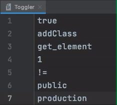

<h1 align="center">
   
  
   
  Toggler
   
</h1>
<h4 align="center">
  Toggler is a JetBrains IDE Plugin that allows you to quickly toggle words and symbols with a hotkey. 
  Toggles can be configured from the settings menu.
</h4>

  
  

  <a href="#features">Features</a> •
  <a href="#usage">Usage</a> •
  <a href="#configuration">Configuration</a> •
  <a href="#installation">Installation</a> •
  <a href="#issues">Issues</a> •
  <a href="#roadmap">Roadmap</a> •
  <a href="#alternatives">Alternatives</a> •
  <a href="#acknowledgements">Acknowledgements</a> •
  <a href="#license">License</a>
    
  

 

## Features
- Customizable through the settings menu.
- Support for multiple cursors.
- Support for numerous toggles.
- Support for partial matches.
- Limited support for transferring word case.
- Easy importing and exporting of the settings configuration.
- No external dependencies required.

## Usage
Select or place your cursor on a word/symbol and press the default hotkey
(<kbd>Ctrl+Shift+X</kbd> on Windows or <kbd>Cmd+Shift+X</kbd> on macOS) to
toggle the word/symbol to the next toggle defined in the configuration file.
The toggle action can also be found as <kbd>Toggle Word/Symbol</kbd> in the <kbd>Edit</kbd> menu.

## Configuration
Configure the toggles from <kbd>Settings/Preferences -> Tools -> Toggler</kbd>. Default toggles have been added to provide functionality right out of the gate. Toggles can be added and removed by modifying the JSON and applying the changes. The Import, Export and Reset to Defaults buttons have been added for convenience. The following characters are used for word/symbol selection and thus can't be used inside the toggles <code>' ', ';', ':', '.', ',', '`', '"', ''', '(', ')', '[', ']', '{', '}'</code>. The partial matching functionality (which is enabled by default) can be disabled in the configuration menu.

## Installation
There are four ways to install Toggler:
- Install directly from the plugin marketplace in your JetBrains product. Go to <kbd>Settings/Preferences -> Plugins -> Marketplace</kbd> and search for <kbd>Toggler</kbd>.
- Install from the [JetBrains marketplace](https://plugins.jetbrains.com/plugin/16166-toggler).
- Download the jar from a [release](https://github.com/Noorts/Toggler/releases) and install manually.
Go to the <kbd>Settings/Preferences -> Plugins</kbd> menu, press the cog in the top right and choose <kbd>Install Plugin from Disk...</kbd>.
- Download this repo, build the plugin and install it manually.

## Issues
- None, currently. Feel free to send me a message or create an issue if you run into unexpected behavior.

## Roadmap
- Create JetBrains "native" UI.
- Add support for language specific toggles.
- Improve transferring word case.

## Alternatives
- If you're looking for more text manipulation features, then check out [Shifter](https://plugins.jetbrains.com/plugin/6149-shifter). Which also includes a dictionary (with custom symbols/words) just like Toggler and includes many other nice features.

## Acknowledgements
This plugin has drawn a lot of inspiration from <a href="https://github.com/HiDeoo">HiDeoo</a> his
original versions of toggle plugins/extensions
for <a href="https://marketplace.visualstudio.com/items?itemName=hideoo.toggler">VSCode</a>
and <a href="https://atom.io/packages/toggler">Atom</a>.

## License
Toggler is licensed under the [MIT license](LICENSE.md).
